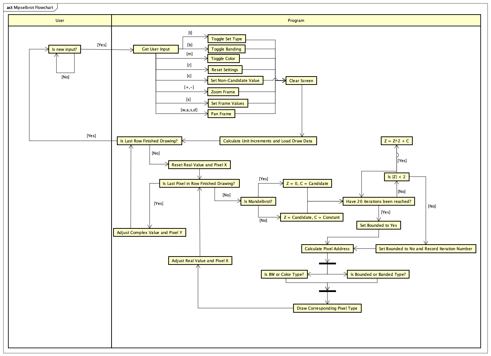

# mipselbrot
### ***A MIPS Mandelbrot and Julia Set Visualization Program***
This MIPS assembly program utilizes floating point operations and the bitmap display in order to visualize either the [Mandelbrot](https://en.wikipedia.org/wiki/Mandelbrot_set) or [Julia Set(s)](https://en.wikipedia.org/wiki/Julia_set) with controls for interactivity. Different color and visualization modes are avaliable in addition to baseline graph viewing capabilities.

## General Usage
1. Load up MARS and the `bitmap.asm` file
2. Read over controls *(also listed below)*
3. Open the **Bitmap Display** and **Keyboard and Display MMIO Simulator** from the *Tools* panel
4. Configure **Bitmap Display** to desired unit resolution and base address *(more details below)*
5. Connect *both* tools
6. Assemble file, run, and input `r` to begin visualizing the sets!

## Bitmap Display Configuration
- The **Unit Resolution** (Display Value/Unit Value) should be no more than 128 by 128 meaning that the following should be considered max **Unit Resolutions**

  - Display Values of *1024* and Unit Values of *8* 
  - Display Values of *512* and Unit Values of *4* 
  - Display Values of *256* and Unit Values of *2* **(RECOMENDED SETTING)**
  - Display Values of *128* and Unit Values of *1* 

*Note: Your choice of unit resolution should be dependent on how you weigh the importance of a detailed visualization versus responsiveness of controls (greater resolution = greater render time)*
## Controls *(while running)*
- Pan View with `w`, `a`, `s`, `d` 
- Zoom View ith `+` and `-`
- Toggle between BW and Color modes with `m`
- Toggle between Bounded and Banding modes with `b`
- Enter Frame Specifications (x-min, x-max, y-min, y-max) `f`
- Toggle between Mandelbrot and Julia Set with `t`
- Specify Julia Candidate Value with `c`

## Program Flowchart
This an approximate flowchart of the execution of `bitmap.asm`

## Tips
- Notice that rendering each frame may take time and some user input is only intended to be taken after `Waiting for user input` is displayed in **Run I/O**
- *Sometimes* the program will bug out and only draw about a quarter of the frame, if this happens, change the base address used in both `bitmap.asm` and in your **Bitmap Display** tool to one of the other options and re-run. If this issue persists, restart MARS or contact me
- Excessively zooming in will cause unexpected behavior, this is due to the limitations of floating point precision numbers in MIPS, and so this should be avoided. This behavior can be noticed if the entire screen becomes one color unexpectedly and can be solved by pressing `r`.

